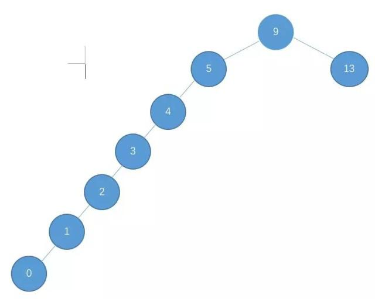
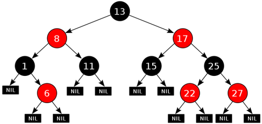
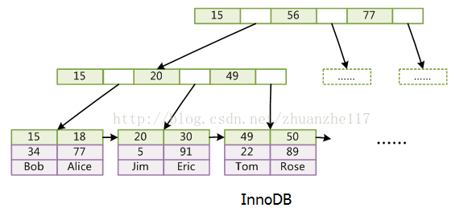
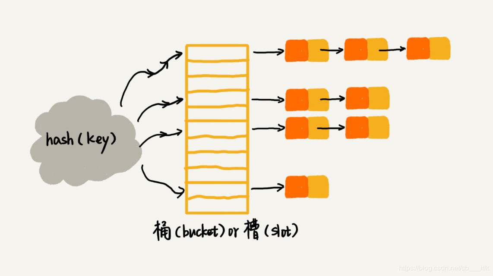

# 常用数据结构

<!-- @import "[TOC]" {cmd="toc" depthFrom=1 depthTo=6 orderedList=false} -->

<!-- code_chunk_output -->

- [常用数据结构](#常用数据结构)
  - [数组（连续存储）](#数组连续存储)
  - [链表（指针连接前后节点）](#链表指针连接前后节点)
  - [树结构（二分思想）](#树结构二分思想)
    - [二叉树](#二叉树)
      - [二叉树的遍历](#二叉树的遍历)
    - [二叉搜索树（二叉排序树）[节点有序]](#二叉搜索树二叉排序树节点有序)
    - [平衡二叉树](#平衡二叉树)
    - [红黑树(不大严格的平衡树)](#红黑树不大严格的平衡树)
      - [红黑树的应用场景](#红黑树的应用场景)
    - [B(balance)树](#bbalance树)
    - [B(balance)+树](#bbalance树-1)
  - [散列表（HASH，key 打散后映射到插槽中，要处理冲突）](#散列表hashkey-打散后映射到插槽中要处理冲突)
  - [图结构](#图结构)

<!-- /code_chunk_output -->

## 数组（连续存储）

- 数组存放的所有元素在内存中是相连的（一块内存空间）
- 添加新元素的速度会很慢（因为元素相连，增加元素的时候如果没有了空间需要重新申请内存空间全部转移元素）
- 随机读取元素时，数组的效率很好，因为可以很快的找到索引位置

## 链表（指针连接前后节点）

## 树结构（二分思想）

### 二叉树

数组存储和链表存储

```c++
typedef struct BiTNode{
    TElemType data;//数据
    struct BiTNode *lchild, *rchild;//左右孩子指针
} BiTNode, *BiTree;
```

#### 二叉树的遍历

看访问某个节点数据的时机

- 前序遍历（先访问数据->左节点->右节点）
- 中序遍历（左节点->中间访问数据->右节点）
- 后序遍历（左节点->右节点->后访问数据）
- 层序遍历

```c++
/*二叉树的前序遍历递归算法*/
void PreOrderTraverse(BiTree T)
{
    if(T==NULL) return;
    printf("%c", T->data);  /*显示结点数据，可以更改为其他对结点操作*/
    PreOrderTraverse(T->lchild);    /*再先序遍历左子树*/
    PreOrderTraverse(T->rchild);    /*最后先序遍历右子树*/
}


/*二叉树的中序遍历递归算法*/
void InOrderTraverse(BiTree T)
{
    if(T==NULL) return;
    InOrderTraverse(T->lchild); /*中序遍历左子树*/
    printf("%c", T->data);  /*显示结点数据，可以更改为其他对结点操作*/
    InOrderTraverse(T->rchild); /*最后中序遍历右子树*/
}


/*二叉树的后序遍历递归算法*/
void PostOrderTraverse(BiTree T)
{
    if(T==NULL) return;
    PostOrderTraverse(T->lchild);   /*先后序遍历左子树*/
    PostOrderTraverse(T->rchild);   /*再后续遍历右子树*/
    printf("%c", T->data);  /*显示结点数据，可以更改为其他对结点操作*/
}
```

### 二叉搜索树（二叉排序树）[节点有序]

1. 二叉查找树要求，在树中的任意一个节点，其左子树中的每个节点的值，都要小于这个节点的值，而右子树节点的值都大于这个节点的值。
2. 中序遍历二叉查找树们可以输出有序的数据序列，时间复杂度是 O(n)，非常高效。因此，二叉查找树也叫作二叉排序树。

### 平衡二叉树

平衡二叉树是为了维持一个“比较高效的树结构”，二叉树极端情况会退化为链表，平衡二叉树就是为了解决二叉查找树退化成一颗链表。


平衡二叉树的特点：
1、具有二叉查找树的全部特性
2、每个节点的左子树和右子树的高度差至多等于 1

### 红黑树(不大严格的平衡树)

红黑树特点：



1. 每个节点都有红色或黑色
2. 树的根始终是黑色的
3. 没有两个相邻的红色节点（红色节点不能有红色父节点或红色子节点，并没有说不能出现连续的黑色节点）
4. 从节点（包括根）到其任何后代 NULL 节点(叶子结点下方挂的两个空节点，并且认为他们是黑色的)的每条路径都具有相同数量的黑色节点

**根据规则 4， 新增节点必须为红色**
**根据规则 3，新增节点之父节点必须为黑色**
当新增节点根据二叉搜索树的规则到达其插入点时，却未能符合上述条件时，就必须调整颜色并旋转树形。

> **为什么有了平衡树还需要红黑树？**
>
> 虽然平衡树解决了二叉查找树退化为近似链表的缺点，能够把查找时间控制在 O(logn)，不过却不是最佳的，因为平衡树要求每个节点的左子树和右子树的高度差至多等于 1，这个要求实在是太严了，导致每次进行插入/删除节点的时候，几乎都会破坏平衡树的第二个规则，进而我们都需要通过左旋和右旋来进行调整，使之再次成为一颗符合要求的平衡树。
>
> 显然，如果在那种插入、删除很频繁的场景中，平衡树需要频繁着进行调整，这会使平衡树的性能大打折扣，为了解决这个问题，于是有了红黑树。
>
> ---
>
> **红黑树的红黑标志有什么用?**
>
> 红黑树使用红黑二色进行“着色”，目的是利用颜色值作为二叉树的平衡对称性的检查，只要插入的节点“着色”满足红黑二色的规定，最短路径与最长路径不会相差的太远，红黑树的节点分布就能大体上达至均衡。

#### 红黑树的应用场景

Java 用它来实现 TreeMap, C++的 std::set/map/multimap 等等

### B(balance)树


### B(balance)+树



## 散列表（HASH，key 打散后映射到插槽中，要处理冲突）

冲突处理：链表法


## 图结构
