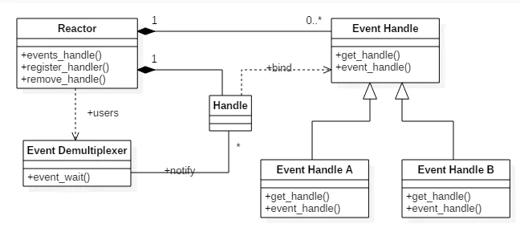

# 网络：实现

<!-- @import "[TOC]" {cmd="toc" depthFrom=1 depthTo=6 orderedList=false} -->

<!-- code_chunk_output -->

- [网络：实现](#网络实现)
  - [select 的实现（轮巡方式）](#select-的实现轮巡方式)
  - [poll 的实现（轮巡方式）](#poll-的实现轮巡方式)
  - [epoll 的实现（回调方式）](#epoll-的实现回调方式)
  - [reactor 模式](#reactor-模式)
  - [proactor 模式](#proactor-模式)

<!-- /code_chunk_output -->

## select 的实现（轮巡方式）

select 函数监视的文件描述符分 3 类，分别是 writefds、readfds、和 exceptfds。调用后 select 函数会阻塞，直到有描述符就绪（有数据 可读、可写、或者有 except），或者超时（timeout 指定等待时间，如果立即返回设为 null 即可），函数返回。当 select 函数返回后，可以通过遍历 fdset，来找到就绪的描述符。


select 方式的缺点:

- select 最大的缺陷就是单个进程所打开的 FD 是有一定限制的，它由 FD_SETSIZE 设置，默认值是 1024。
- 对 socket 进行扫描时是线性扫描，即采用轮询的方法，效率较低。
- 需要维护一个用来存放大量 fd 的数据结构，这样会使得用户空间和内核空间在传递该结构时复制开销大。

## poll 的实现（轮巡方式）

poll 本质上和 select 没有区别，它将用户传入的数组拷贝到内核空间，然后查询每个 fd 对应的设备状态，如果设备就绪则在设备等待队列中加入一项并继续遍历，如果遍历完所有 fd 后没有发现就绪设备，则挂起当前进程，直到设备就绪或者主动超时，被唤醒后它又要再次遍历 fd。这个过程经历了多次无谓的遍历。

## epoll 的实现（回调方式）

epoll 使用“事件”的就绪通知方式，通过 epoll_ctl 注册 fd，一旦该 fd 就绪，内核就会采用类似 callback 的回调机制来激活该 fd，epoll_wait 便可以收到通知。

```c++
int epoll_create(int size);
int epoll_ctl(int epfd, int op, int fd, struct epoll_event *event);
int epoll_wait(int epfd, struct epoll_event *events,int maxevents, int timeout);

// linux kernel
// 当某一进程调用epoll_create方法时，Linux内核会创建一个eventpoll结构体
struct eventpoll {
　　...
　　/*红黑树的根节点，这棵树中存储着所有添加到epoll中的事件，
　　也就是这个epoll监控的事件*/
　　struct rb_root rbr;
　　/*双向链表rdllist保存着将要通过epoll_wait返回给用户的、满足条件的事件*/
　　struct list_head rdllist;
　　...
};

/*
一颗红黑树，一张准备就绪句柄链表，少量的内核 cache，就帮我们解决了大并发下的 socket 处理问题。
1. 执行 epoll_create()时，创建了红黑树和就绪链表；
2. 执行 epoll_ctl()时，如果增加 socket 句柄，则检查在红黑树中是否存在，存在立即返回，不存在则添加到树干上，
然后向内核注册回调函数，用于当中断事件来临时向准备就绪链表中插入数据；
4. 执行 epoll_wait()时立刻返回准备就绪链表里的数据即可。
*/
```

epoll 的优点：

- 没有最大并发连接的限制，能打开的 FD 的上限远大于 1024（1G 的内存上能监听约 10 万个端口）。
- 效率提升，不是轮询的方式，不会随着 FD 数目的增加效率下降。只有活跃可用的 FD 才会调用 callback 函数；即 Epoll 最大的优点就在于它只管你“活跃”的连接，而跟连接总数无关，因此在实际的网络环境中，Epoll 的效率就会远远高于 select 和 poll。
- 内存拷贝，利用 mmap()文件映射内存加速与内核空间的消息传递；即 epoll 使用 mmap 减少复制开销。

epoll 的两种工作模式：

- LT 模式：当 epoll_wait 检测到描述符事件发生并将此事件通知应用程序，应用程序可以不立即处理该事件。下次调用 epoll_wait 时，会再次响应应用程序并通知此事件。

- ET 模式：当 epoll_wait 检测到描述符事件发生并将此事件通知应用程序，应用程序必须立即处理该事件。如果不处理，下次调用 epoll_wait 时，不会再次响应应用程序并通知此事件。

## reactor 模式

**Reactor 的核心思想：**

将关注的 I/O 事件注册到多路复用器上，一旦有 I/O 事件触发，将事件分发到事件处理器中，执行就绪 I/O 事件对应的处理函数中。模型中有三个重要的组件：

多路复用器：由操作系统提供接口，Linux 提供的 I/O 复用接口有 select、poll、epoll；
事件分离器：将多路复用器返回的就绪事件分发到事件处理器中；
事件处理器：处理就绪事件处理函数。



## proactor 模式
