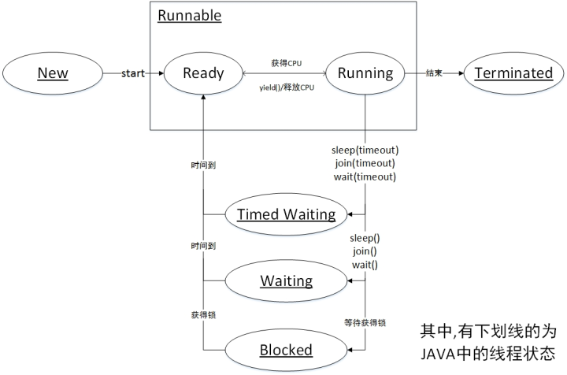
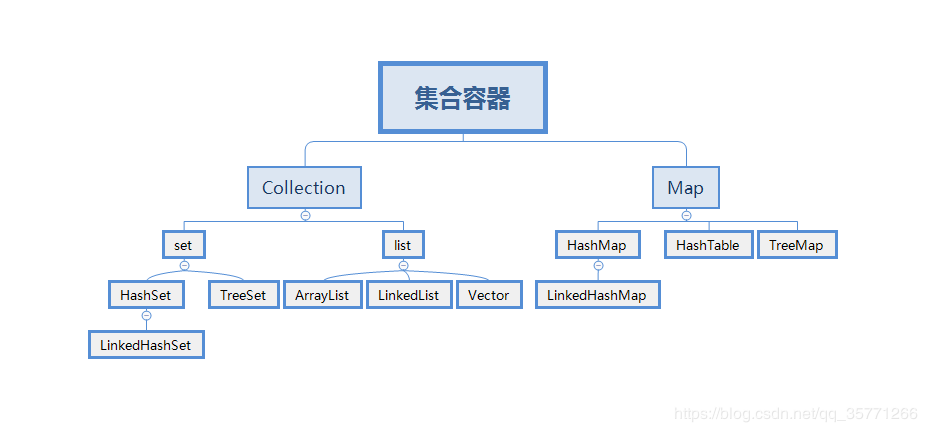
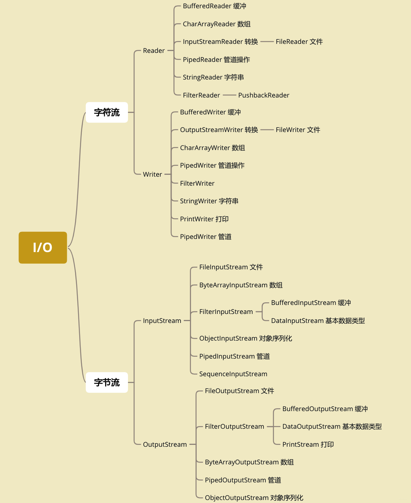

# java

<!-- @import "[TOC]" {cmd="toc" depthFrom=1 depthTo=6 orderedList=false} -->

<!-- code_chunk_output -->

- [java](#java)
  - [==和 equals 的区别](#和-equals-的区别)
  - [什么是反射？](#什么是反射)
  - [四种引用状态](#四种引用状态)
  - [包装类的常量池](#包装类的常量池)
  - [String 常量池](#string-常量池)
  - [String 为什么要设置成 final 的？](#string-为什么要设置成-final-的)
  - [自动拆箱装箱](#自动拆箱装箱)
  - [ClassNotFoundException 和 NoClassDefFoundException 的区别？](#classnotfoundexception-和-noclassdeffoundexception-的区别)
  - [java 线程状态](#java-线程状态)
  - [Thread.sleep、Thread.yield、obj.wait、t.join 的区别？](#threadsleep-threadyield-objwait-tjoin-的区别)
  - [三种代理模式](#三种代理模式)
    - [静态代理（implement interface）](#静态代理implement-interface)
    - [jdk 中的 Proxy.newProxyInstance 动态代理（implement interface）](#jdk-中的-proxynewproxyinstance-动态代理implement-interface)
    - [cglib 代理（extends class）](#cglib-代理extends-class)
      - [cglib 的实现原理](#cglib-的实现原理)
  - [集合容器](#集合容器)
    - [HashMap1.7 的实现](#hashmap17-的实现)
    - [HashMap 1.8 的实现](#hashmap-18-的实现)
    - [HashMap 的 hash 方法](#hashmap-的-hash-方法)
    - [jdk1.7 的 HashMap 的死循环](#jdk17-的-hashmap-的死循环)
    - [有没有有序的 Map？](#有没有有序的-map)
  - [JAVA 中容器的数据结构实现](#java-中容器的数据结构实现)
  - [Jdk IO](#jdk-io)
  - [Java 网络 IO](#java-网络-io)
    - [BIO（一个连接一个线程）](#bio一个连接一个线程)
    - [BIO 线程池](#bio-线程池)
    - [NIO（一个请求一个线程）， Reactor](#nio一个请求一个线程-reactor)
      - [Channel](#channel)
      - [Buffer](#buffer)
      - [Selector（Reactor）](#selectorreactor)
    - [AIO（一个有效请求一个线程），Proactor](#aio一个有效请求一个线程proactor)

<!-- /code_chunk_output -->

## ==和 equals 的区别

- ==比较内存地址
- equals 调用对象的 equal 方法比较。

## 什么是反射？

Java 反射机制是在运行状态中，对于任意一个类（Class 文件），都能够知道这个类的属性和方法；对于任意一个对象都能调用它的方法和属性；

## 四种引用状态

1. 强引用 通过 Object obj = new Object()创建的引用
2. 软引用 有用但并非必须的对象，内存不足时会被回收，适合做内存缓存，既能提高查询效率，也不会造成内存泄漏
   系统发生内存溢出异常前，将会把这些对象列进回收范围进行二次回收。如果这次回收还没有足够的内存，才会抛出内存溢出异常。Java 中的 SoftReference 表示软引用
3. 弱引用 在下一次 GC 中会被回收掉，ThreadLocal 和 WeakHashMap 都使用了弱引用。Java 中的类 WeakReference 表示弱引用
4. 虚引用 无法从虚引用中拿到对象，被虚引用的对象就跟不存在一样。虚引用用来跟踪垃圾回收情况，或者可以完成垃圾收集器之外的定制化操作。Java NIO 中的堆外内存因为不受 GC 的管理，就是通过虚引用完成。

## 包装类的常量池

- Java 基本类型的包装类的大部分都实现了常量池技术，即 Byte,Short,Integer,Long,Character,Boolean。
- Float,Double 没有实现常量池
- Java 缓存了-128 到 127 范围内的 Integer 类。所以当你给这个范围的封装类赋值时，装箱操作会调用 Integer.valueOf() 函数，反过来就会给封装类赋上一个缓存池实例的引用。
  另一方面来说，如果用超出这个范围的值给封装类赋值时，Integer.valueOf()会创建一个新的 Integer 类。因此，比对超出这个范围的 Integer 类时，会返回 false。

```java
public static Integer valueOf(int i) {
    return i >= -128 && i <= Integer.IntegerCache.high ? Integer.IntegerCache.cache[i + 128] : new Integer(i);
}
```

## String 常量池

- 直接使用双引号声明出来的 String 对象会直接存储在常量池中，例如，String str = "111"
- string 可以通过 intern()方法，把一个字符串加入常量池中，例如，String str = new String("111").intern()

## String 为什么要设置成 final 的？

- 为了实现字符串池
- 安全问题
- 多线程传递字符串不用加锁，线程安全
- 为了实现 String 可以创建 HashCode 不可变性

## 自动拆箱装箱

- 简单来说装箱就是自动将基本数据类型转换为包装器类型，拆箱就是自动将包装器类型转化为基本类型。
- 通过反编译 class 文件可知，装箱的时候调用的是 Integer 的 valueOf 方法，拆箱时调用的是 Integer 的 intValue 方法

其他的包装器类也类似

## ClassNotFoundException 和 NoClassDefFoundException 的区别？

- jvm 的 classloader 加载类时，如果在 classpath 中没有找到 class,则是 ClassNotFoundException，通常是设置 classpath 不对，或者缺少 java 包。
- class 如果加载成功之后，会有一个该类的类对象（class 对象），当在内存当中没有找到这个类对象，就会出现 NotClassDefFoundError，通常是因为 class 中存在 static 方法，static 方法执行失败导致 class 没有加载到内存中。

## java 线程状态



## Thread.sleep、Thread.yield、obj.wait、t.join 的区别？

1. sleep 方法是线程类 Thread 的静态方法，sleep 方法是属于 Thread 类中的，sleep 过程中线程不会释放锁，只会阻塞线程，让出 cpu 给其他线程。
2. 和 sleep 一样都是 Thread 类的方法，都是暂停当前正在执行的线程对象，不会释放资源锁，和 sleep 不同的是 yield 方法并不会让线程进入阻塞状态，而是让线程重回就绪状态，它只需要等待重新获取 CPU 执行时间，所以执行 yield()的线程有可能在进入到可执行状态后马上又被执行。
3. wait 方法是属于 Object 类中的，wait 过程中线程会释放对象锁，只有当其他线程调用 notify 才能唤醒此线程。wait 使用时必须先获取对象锁，即必须在 synchronized 修饰的代码块中使用，那么相应的 notify 方法同样必须在 synchronized 修饰的代码块中使用，如果没有在 synchronized 修饰的代码块中使用时运行时会抛出 IllegalMonitorStateException 的异常。
4. join 方法调用后，等待调用 join 方法的线程结束之后，程序再继续执行，一般用于等待异步线程执行完结果之后才能继续运行的场景。

## 三种代理模式

### 静态代理（implement interface）

- 被代理对象与代理对象需要一起实现相同的接口或者是继承相同父类，因此要定义一个接口或抽象类。
- 根据相同的 interface, 自己手动写代理类
- 必须要存在 interface

### jdk 中的 Proxy.newProxyInstance 动态代理（implement interface）

- 使用 jdk 中的 Proxy.newProxyInstance 方法，根据 interface,来生成代理对象。
- 不需要自己 implements interface
- 必须要存在 interface

### cglib 代理（extends class）

- JDK 的动态代理有一个限制,就是使用动态代理的对象必须实现一个或多个接口,如果想代理没有实现接口的类,就可以使用 Cglib 实现.
- cglib 既可以代理 interface,又可以代理 class
- 由于 cglib 对 class 代理时使用的是 extends 父类的方法，所以，代理的类不能为 final,否则会报错。

#### cglib 的实现原理

## 集合容器

### HashMap1.7 的实现

数据结构：采用了数组+单链表的实现
冲突解决：链表+头插法
扩容：75%

### HashMap 1.8 的实现

- HashMap 的数据结构是哈希表结构（数组+链表+红黑树）实现，默认数组长度 16，数组在超过 75%时扩容，每次乘 2，链表长度超过 8 时链表转为红黑树，小于 6 又转为链表
- 可以创建一个线程安全的 HashMap，Collections.synchronizedMap(new HashMap<>())，不过实现方式比较粗暴，直接对 map 的方法加 synchronized

### HashMap 的 hash 方法

这段代码叫“扰动函数”，是为了减少 hash 碰撞的概率。

```java
//Java 8中的散列值优化函数
static final int hash(Object key) {
  int h;
  return (key == null) ? 0 : (h = key.hashCode()) ^ (h >>> 16); //key.hashCode()为哈希
}
```

右位移 16 位，正好是 32bit 的一半，自己的高半区和低半区做异或，就是为了混合原始哈希码的高位和低位，以此来加大低位的随机性。而且混合后的低位掺杂了高位的部分特征，这样高位的信息也被变相保留下来。

### jdk1.7 的 HashMap 的死循环

rehash 时，链表使用的是前插法，前插法会让链表数据顺序颠倒，就有可能会导致死循环。
jdk1.8 中，采用了尾插法，不会有循环链表出现，所以解决了 1.7 中的链表前插法导致的死循环，但是 HashMap 任然不是线程安全的。

### 有没有有序的 Map？

LinkedHashMap：在 HashMap 的基础上，又在内部增加了一个链表，用以存放元素的顺序。可以分为插入有序和访问有序。默认插入有序方式
TreeMap：按照 key 有序

## JAVA 中容器的数据结构实现



| 容器              | 数据结构                                                                                 |
| :---------------- | :--------------------------------------------------------------------------------------- |
| ArrayList         | 数组                                                                                     |
| Vector            | 数组                                                                                     |
| LinkedList        | 双向链表                                                                                 |
| Stack             | Vector                                                                                   |
| HashMap (java1.7) | 底层实现是数组+链表                                                                      |
| HashMap (java1.8) | 数组+链表+红黑树，当冲突链表长度大于 8 时，链表转为红黑树，小于等于 6 时，红黑树转为链表 |
| LinkedHashMap     | HashMap + 双向链表，插入顺序有序                                                         |
| TreeMap           | 按照 key 升序                                                                            |
| HashSet           | HashMap                                                                                  |
| LinkedHashSet     | LinkedHashMap + 双向链表（保证插入和读取顺序一致）                                       |
| TreeSet           | 带全排序的集合容器                                                                       |

> 问：java HashMap 和 LinkedHashMap 的区别？
>
> HashMap 是无序的，当我们希望有顺序地去存储 key-value 时，就需要使用 LinkedHashMap 了，LinkedHashMap 默认的构造参数是默认 插入顺序的，就是说你插入的是什么顺序，读出来的就是什么顺序。

## Jdk IO



## Java 网络 IO

### BIO（一个连接一个线程）

同步并阻塞，服务器实现模式为一个连接一个线程，即客户端有连接请求时服务器端就需要启动一个线程进行处理，如果这个连接不做任何事情会造成不必要的线程开销，当然可以通过线程池机制改善

### BIO 线程池

当新客户端接入时,将客户端的 socket 封装成一个 Task(该任务实现 Runnable 接口)投递到线程池处理,线程池维护一个队列,资源可控,无论多少个客户端并发都不会造成耗尽和宕机。

### NIO（一个请求一个线程）， Reactor

同步非阻塞，服务器实现模式为一个请求一个线程，即客户端发送的连接请求都会注册到多路复用器上，多路复用器轮询到连接有 I/O 请求时才启动一个线程进行处理。

#### Channel

#### Buffer

#### Selector（Reactor）

### AIO（一个有效请求一个线程），Proactor

异步非阻塞，服务器实现模式为一个有效请求一个线程，客户端的 IO 请求都是由 OS 先完成了再通知服务器应用去启动线程进行处理。
