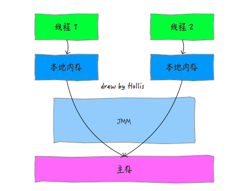
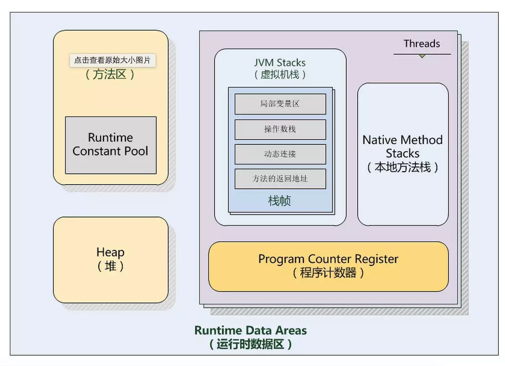
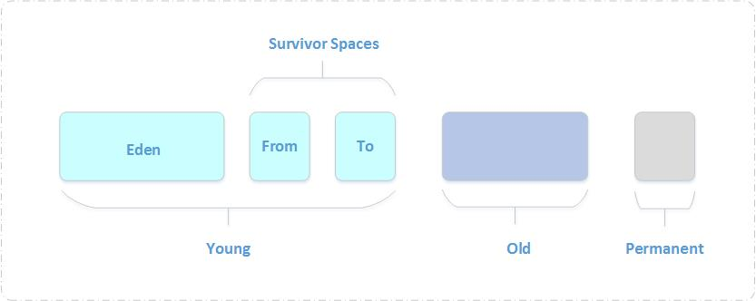

<!-- @import "[TOC]" {cmd="toc" depthFrom=1 depthTo=6 orderedList=false} -->

<!-- code_chunk_output -->

- [创建一个空 Object 占用多少内存](#创建一个空-object-占用多少内存)
- [类加载器](#类加载器)
  - [类加载器分类](#类加载器分类)
  - [类加载机制一:全盘委托](#类加载机制一全盘委托)
  - [类加载机制二：双亲委派](#类加载机制二双亲委派)
  - [类加载流程](#类加载流程)
- [JMM（java memory model）是什么？](#jmmjava-memory-model是什么)
  - [JMM 内存模型的实现](#jmm-内存模型的实现)
  - [happen before](#happen-before)
  - [主内存和工作内存同步的时机？](#主内存和工作内存同步的时机)
- [jvm 内存结构](#jvm-内存结构)
  - [jvm 内存划分](#jvm-内存划分)
  - [jvm 内存为什么要分代？](#jvm-内存为什么要分代)
    - [新生代（Young）](#新生代young)
    - [老年代（Old）](#老年代old)
    - [永久代（Permanent）](#永久代permanent)
    - [Minor GC 和 Full GC 的区别](#minor-gc-和-full-gc-的区别)
- [判断对象是否存活的方法](#判断对象是否存活的方法)
- [宣告对象死亡需经过两个过程](#宣告对象死亡需经过两个过程)
- [jvm 垃圾回收算法](#jvm-垃圾回收算法)
- [Minor GC、Major GC、Full GC、mixed gc 是什么？](#minor-gc-major-gc-full-gc-mixed-gc-是什么)
- [jvm 中的垃圾回收器](#jvm-中的垃圾回收器)
  - [Serial 收集器（新生代，复制算法）](#serial-收集器新生代复制算法)
  - [ParNew 收集器（新生代，复制算法）](#parnew-收集器新生代复制算法)
  - [Parallel Scavenge 收集器（新生代，复制算法）](#parallel-scavenge-收集器新生代复制算法)
  - [Serial Old 收集器（老年代，标记-整理算法）](#serial-old-收集器老年代标记-整理算法)
  - [Parallel Old 收集器（老年代，标记-整理算法）](#parallel-old-收集器老年代标记-整理算法)
  - [CMS 收集器（老年代，标记-清除算法）](#cms-收集器老年代标记-清除算法)
  - [CMS 收集器的缺点：](#cms-收集器的缺点)
    - [为什么 CMS 两次标记时要 stop the world](#为什么-cms-两次标记时要-stop-the-world)
  - [G1 收集器（标记-整理）：优先处理那些垃圾多的内存块](#g1-收集器标记-整理优先处理那些垃圾多的内存块)
    - [G1 收集器是如何做到可预测的停顿的？](#g1-收集器是如何做到可预测的停顿的)
  - [Parallel scavenge 收集器与 ParNew 收集器的区别？](#parallel-scavenge-收集器与-parnew-收集器的区别)
  - [CMS 和 G1 收集器的区别？](#cms-和-g1-收集器的区别)
  - [什么是 GC ROOT，GC 如何找到死亡的对象？](#什么是-gc-rootgc-如何找到死亡的对象)
  - [触发 FullGC 的场景](#触发-fullgc-的场景)
- [触发内存泄漏的场景](#触发内存泄漏的场景)
- [触发栈内存溢出的场景](#触发栈内存溢出的场景)
- [JVM 如何调优](#jvm-如何调优)
- [JVM 相关工具](#jvm-相关工具)
- [java 命令常用参数](#java-命令常用参数)
- [如何定位 cpu 100%问题？](#如何定位-cpu-100问题)
- [如何定位内存 100%问题？](#如何定位内存-100问题)

<!-- /code_chunk_output -->

## 1. 创建一个空 Object 占用多少内存

1. Object obj = new Object()，其中 obj 是一个指向对象的引用，引用长度决定了 Java 的寻址能力，32 位 JDK 是 4 字节，64 位 JDK 是 8 字节
2. 64 位系统 引用占 8 字节，对象占 16 字节，共 24 字节，32 位系统引用站 4 字节，对象占 8 字节，共 12 字节

## 2. 类加载器

### 2.1. 类加载器分类

1. BootstrapClassLoader 启动加载类，主要加载核心类库（JRE 的 lib）
2. ExtClassLoader 扩展类加载器，加载 JRE 的 lib/ext 下的 class 文件和 jar 包
3. AppClassLoader 加载当前应用的 classpath 的所有类
4. BootstrapClassLoader 对 Java 不可见，当获取父加载器为 null 时说明是顶级类加载器

### 2.2. 类加载机制一:全盘委托

当一个 ClassLoader 装载一个类时，除非显示地使用另一个 ClassLoader，则该类所依赖及引用的类也由这个 CladdLoader 载入。

### 2.3. 类加载机制二：双亲委派

- 当一个类加载器收到类加载任务，会先交给其父类加载器去完成，因此最终加载任务都会传递到顶层的启动类加载器，只有当父类加载器无法完成加载才会尝试自己去加载。
- 目的是为了避免重复加载，已经加载的无需加载。更加安全，避免了随意加载核心 class。
- 自定义类加载器如果重写了 loadClass 方法会破坏双亲委派模式。

### 2.4. 类加载流程

1. 加载: 加载 class 字节码文件
2. 链接
   - 验证：主要的目的是确保被加载的类（.class 文件的字节流）满足 Java 虚拟机规范，不会造成安全错误。
   - 准备：负责为类的静态成员分配内存，并设置默认初始值。
   - 解析：将类的二进制数据中的符号引用替换为直接引用。
3. 初始化：对 static 修饰的变量或语句块进行初始化

## 3. JMM（java memory model）是什么？

1. 所有的变量都存储在主内存中(虚拟机内存的一部分)，对于所有线程都是共享的。
2. 每条线程都有自己的工作内存，工作内存中保存的是主存中某些变量的拷贝，线程对变量的所有操作都必须在工作内存中进行，而不能直接读写主内存中的变量。
3. 线程之间无法直接访问对方的工作内存中的变量，线程间变量的传递均需要通过主内存来完成。

JMM 是一种规范，目的是解决由于多线程通过共享内存进行通信时，存在的本地内存数据不一致、编译器会对代码指令重排序、处理器会对代码乱序执行等带来的问题。目的是保证并发编程场景中的原子性、可见性和有序性。

### 3.1. JMM 内存模型的实现

- 原子性： monitorenter 和 monitorexit 指令，CAS 也是保证原子性。
- 可见性：volatile
- 有序性：volatile 关键字会禁止指令重排。synchronized 关键字保证同一时刻只允许一条线程操作

### 3.2. happen before

如果前一个操作的执行结果必须对后一个操作可见，那就不允许这两个操作进行重排序，且 happen-befor 具有传递性。

### 3.3. 主内存和工作内存同步的时机？

## 4. jvm 内存结构

### 4.1. jvm 内存划分

1. 程序计数器（线程私有） 当前线程所执行的字节码的行号指示器，用于记录正在执行的虚拟机字节指令地址
2. Java 虚拟机栈（线程私有） 存放基本数据类型、对象引用、方法出口等
3. 本地方法栈（线程私有） 和虚拟机栈类似，只不过他服务于本地方法
4. Java 堆（线程共享） 所有实例对象、数组都存放在 java 堆中，GC 回收的地方
5. 方法区（线程共享） 存放已经被加载的类信息、常量、静态变量、及时编译器编译后的代码数据等（即永久带），回收目标主要是常量池的回收和类型的卸载

### 4.2. jvm 内存为什么要分代？

基于两个共识：

- 绝大多数对象都是朝生夕死的，短命
- 熬过越多次垃圾收集过程的对象就越难以消亡

#### 4.2.1. 新生代（Young）

1. 新生成的对象优先存放在新生代中，新生代对象朝生夕死，存活率很低，在新生代中，常规应用进行一次垃圾收集一般可以回收 70% ~ 95% 的空间，回收效率很高。
2. 新生代划分为三块，一块较大的 Eden 空间和两块较小的 Survivor 空间，默认比例为 8：1：1。划分的目的是因为 HotSpot 采用复制算法来回收新生代，设置这个比例是为了充分利用内存空间，减少浪费。新生成的对象在 Eden 区分配（大对象除外，大对象直接进入老年代），当 Eden 区没有足够的空间进行分配时，虚拟机将发起一次 Minor GC。
3. survivor 中的对象，年龄值达到年龄阀值（默认为 15，新生代中的对象每熬过一轮垃圾回收，年龄值就加 1，GC 分代年龄存储在对象的 header 中）的对象会被移到老年代中。

#### 4.2.2. 老年代（Old）

1. 老年代存放的对象都是存活比较久的对象（Minor GC 15 次）
2. 老年代也会直接存放一些大对象
3. 老年代触发 GC 的话成为 （Full GC/Major GC）

#### 4.2.3. 永久代（Permanent）

1. 永久代是方法区的实现，虚拟机上是没有永久代的，方法区只是规范
2. Java1.8 之前 方法区位于永久代中，同时，永久代和堆是相互隔离的，但是物理内存是连续的
3. Java1.8 之后 使用元空间（Metaspace）替代了永久代，方法区存在于元空间，而且不再与堆连续，而且是存在于本地内存，当堆触发 GC 时，本地内存不会触发 GC，当然也可以设置上限和初始化的大小
4. 使用元空间替换永久代是为了避免 OOM，因为永久区的上限并不好确定，设置不好就容易出问题，特别是项目中用了大量的反射来创建对象

#### 4.2.4. Minor GC 和 Full GC 的区别

1. 新生代 GC（Minor GC）：Minor GC 指发生在新生代的 GC，因为新生代的 Java 对象大多都是朝生夕死，所以 Minor GC 非常频繁，一般回收速度也比较快。当 Eden 空间不足以为对象分配内存时，会触发 Minor GC。
2. 老年代 GC（Full GC/Major GC）：Full GC 指发生在老年代的 GC，出现了 Full GC 一般会伴随着至少一次的 Minor GC（老年代的对象大部分是 Minor GC 过程中从新生代进入老年代），比如：分配担保失败。Full GC 的速度一般会比 Minor GC 慢 10 倍以上。当老年代内存不足或者显式调用 System.gc()方法时，会触发 Full GC。

## 5. 判断对象是否存活的方法

1. 引用计数器：为每个对象创建一个引用计数，有对象引用+1，引用释放-1，为 0 时可回收，例如 c++的 shared_ptr，但是如果循环引用则会出现内存泄漏。
2. 可达性分析算法：虚拟机栈中引用的对象（栈帧），方法区中静态属性引用的对象，方法区中常量用的对象，本地方法栈中引用的对象

## 6. 宣告对象死亡需经过两个过程

1. 可达性分析后没有发现引用链
2. 查看对象是否有 finalize 方法，如果有重写且在方法内完成自救[比如再建立引用]，还是可以抢救一下

## 7. jvm 垃圾回收算法

1. 标记-清除算法 分标记和清除两个阶段，先标记出所有需要回收的对象，在标记完成后统一回收掉所有被标记对象。不需要移动对象，要暂停整个应用，且会产生大量不连续的内存碎片，碎片太多会导致生成大对象空间不足触发新的垃圾回收
2. 复制算法 将可用内存按容量划分为大小相等的两块，每次只使用一块，这块用完了将存活对象复制到另外一块上面，然后把已使用过的空间一次清理掉。不易产生内存碎片，但是内存空间缩减为原来的一半，存活对象越多效率越低
3. 标记-整理算法 让所有存活的对象都向一端移动，然后直接清理掉边界以外的内存。结合了标记清楚和复制两种算法的优点
4. 分代收集算法 把 Java 堆内存分为新生代和老年代，这样根据各个年代的特点采用适当的收集算法。老年代每次只有少量对象需要被回收，新生代有大量的对象需要被回收。

## 8. Minor GC、Major GC、Full GC、mixed gc 是什么？

- Minor GC： 年轻代的 GC
- Major GC：老年代的 GC
- Full GC：年轻代，老年代，永久代统一回收
- mixed GC【g1 特有】：混合 GC

## 9. jvm 中的垃圾回收器

- 新生代收集器：Serial、ParNew、Parallel Scavenge
- 老年代收集器：CMS、Serial Old、Parallel Old
- 整堆收集器： G1

### 9.1. Serial 收集器（新生代，复制算法）

单线程收集器，收集垃圾时会 stop the world

### 9.2. ParNew 收集器（新生代，复制算法）

是 Serial 收集器的多线程版本，和 Serial 收集器一样存在 Stop The World 问题

ParNew 收集器是许多运行在 Server 模式下的虚拟机中首选的新生代收集器，因为它是除了 Serial 收集器外，唯一一个能与 CMS 收集器配合工作的。

### 9.3. Parallel Scavenge 收集器（新生代，复制算法）

并发的多线程收集器，追求高吞吐量，高效利用 CPU，吞吐量一般为 99%（100 分钟一分钟在回收垃圾）

### 9.4. Serial Old 收集器（老年代，标记-整理算法）

Serial 收集器的老年代版，单线程收集

### 9.5. Parallel Old 收集器（老年代，标记-整理算法）

Paralle Scavenge 的老年代版本

### 9.6. CMS 收集器（老年代，标记-清除算法）

一种以获取最短回收停顿时间为目标的收集器。
常见的应用场景是 互联网站或者 B/S 系统的服务端上的 Java 应用 。

运作流程：
**初始标记**：仅仅只是标记一下 GC Roots 能直接关联到的对象，速度很快，需要“Stop The World”。
**并发标记**：进行 GC Roots Tracing 的过程，找出存活对象且用户线程可并发执行。
**重新标记**：为了修正并发标记期间因用户程序继续运行而导致标记产生变动的那一部分对象的标记记录。仍然存在 Stop The World 问题。
**并发清除**：对标记的对象进行清除回收。

### 9.7. CMS 收集器的缺点：

- 垃圾碎片的问题：标记-清除 算法的，所以不可避免的就是会出现垃圾碎片的问题。
  **解决方法**：按一定频率进行堆整理

  > -XX:CMSFullGCsBeforeCompaction=n 配置，CMS GC 执行一定次数的标记-清除后，执行一次标记-压缩，从而可以控制老年代的碎片在一定的数量以内。

- remark 重新标记阶段时间长：在 CMS 的这四个主要的阶段中，最费时间的就是重新标记阶段。
  **解决方案**: remark 操作之前先做一次 Young GC ，目的在于减少年轻代对老年代的无效引用

  > -XX:+CMSScavengeBeforeRemark

- 并发模式失败（concurrent mode failure） : 产生的原因是老年代的可用空间不够了（因为正常晋升入老年代的对象太多太快，或者由于新生代不够而从创建就直接进入老年代的对象太多）
  **解决方案**：让 CMS 更早更频繁的触发，降低年老代被占满的可能

  > -XX:CMSInitiatingOccupancyFraction=60，设定 CMS 在对内存占用率达到 60%的时候开始 GC。

- 提升失败（promotion failed）：由于救助空间不够，从而向年老代转移对象，年老代没有足够的空间来容纳这些对象，导致一次 full gc 的产生。
  **解决方案**：增大救助空间

#### 9.7.1. 为什么 CMS 两次标记时要 stop the world

- CMS 并非没有暂停，而是用两次短暂停来替代串行标记整理算法的长暂停。

### 9.8. G1 收集器（标记-整理）：优先处理那些垃圾多的内存块

运作流程：初始标记，并发标记，最终标记，筛选标记。不会产生空间碎片，可以精确控制停顿

1. 重新定义了堆空间，打破了原有的分代模型，将堆划分为一个个区域，这么做的目的是在进行收集时不必在全对范围内进行。区域划分的好处就是带来了停顿时间可预测收集模型：用户可以指定收集操作在多长时间内完成
2. G1 收集器具备如下特点 并行与并发：充分利用 CPU，使用多个 CPU 缩短 Stop-the-world 停顿的时间，部分其他收集器原来需要停顿 Java 线程执行的 GC 操作，G1 收集器仍然可以通过并发的方式让 Java 程序继续运行，分代收集，空间整合：与 CMS 标记-清楚算法不同，G1 从整体来看是基于标记-整理算法实现的收集器，从局部（两个 Region 之间）上来看就是基于复制算法实现的，意味着 G1 运作期不会产生内存空间碎片，收集后提供规整的内存，这种特性有利于程序长时间运行，分配大对象时不会因为无法找到连续内存空间而提前出发下一次 GC 可预测的停顿：他可以避免在整个 Java 堆中进行全区域的垃圾收集

#### 9.8.1. G1 收集器是如何做到可预测的停顿的？

它是“选择一些内存块”，而不是整代内存来回收，这是 G1 跟其它 GC 非常不同的一点，其它 GC 每次回收都会回收整个 Generation 的内存(Eden, Old), 而回收内存所需的时间就取决于内存的大小，以及实际垃圾的多少，所以垃圾回收时间是不可控的；而 G1 每次并不会回收整代内存，到底回收多少内存就看用户配置的暂停时间，配置的时间短就少回收点，配置的时间长就多回收点，伸缩自如。

G1 通过在垃圾回收领域应用并行化的策略，把几块大内存块的回收问题，变成了几百块小内存的回收问题，使得回收算法可以高度并行化，同时也因为分成很多小块，使得垃圾回收的单位变成了小块内存，而不是整代内存，使得用户可能对回收时间进行配置，垃圾回收变得可以预期了。

### 9.9. Parallel scavenge 收集器与 ParNew 收集器的区别？

parallel scavenge 有垃圾自适应调节策略。

### 9.10. CMS 和 G1 收集器的区别？

1. CMS 收集器是老年代收集器，可以配合新生代的 Serial 和 ParNew 收集器一起使用
2. G1 收集器范围是老年代和新生代，不需要结合其他收集器使用
3. CMS 收集器以最小停顿时间为目标的收集器
4. G1 收集器可预测垃圾回收的停顿时间
5. CMS 收集器使用 标记-清楚 算法，容易产生内存碎片
6. G1 收集器使用 标记-整理算法，降低了内存碎片
7. G1 收集器可以同时解决对象创建和对象回收的问题

### 9.11. 什么是 GC ROOT，GC 如何找到死亡的对象？

所谓“GC roots”，或者说 tracing GC 的“根集合”，就是一组必须活跃的引用。

Tracing GC 的根本思路就是：给定一个集合的引用作为根出发，通过引用关系遍历对象图，能被遍历到的（可到达的）对象就被判定为存活，其余对象（也就是没有被遍历到的）就自然被判定为死亡。注意再注意：tracing GC 的本质是通过找出所有活对象来把其余空间认定为“无用”，而不是找出所有死掉的对象并回收它们占用的空间。

GC roots 这组引用是 tracing GC 的起点。要实现语义正确的 tracing GC，就必须要能完整枚举出所有的 GC roots，否则就可能会漏扫描应该存活的对象，导致 GC 错误回收了这些被漏扫的活对象

### 9.12. 触发 FullGC 的场景

1. 当 Eden 区和幸存区 From 满时
2. 调用 System.gc()或 Runtime.getRuntime().gc()时，不一定会执行 Full GC
3. 老年代空间不足
4. 方法区空间不足
5. 通过 Minor GC 后进入老年代的平均大小大于老年代的可用内存
6. 幸存区 From 到幸存区 To 时发现 To 空间不足转向老年代且老年代可用内存不够
7. 老年代写满会触发 Full GC 8.持久代被写满会触发 Full GC 9.手动调用 gc 方法会触发 Full GC

## 10. 触发内存泄漏的场景

1. 静态类集合 GC 不会收集静态类
2. 各种连接 数据库连接，网络连接，IO 先关如果不 close
3. 强引用 肯定不会回收
4. 监听器的使用 释放内存的同时没有相应删除监听器的时候也可能会导致内存泄漏

## 11. 触发栈内存溢出的场景

1. 栈用来存储基本数据类型，对象应用，操作数栈，动态链接方法，方法出口等信息
2. 栈深度大于虚拟机所允许的最大深度，将抛出 StackOverflowError 异常，递归方法。
3. 如果能动态扩展又无法申请到足够的内存，或者新建线程时没有足够的内存会抛出 OutOfMemory 异常

## 12. JVM 如何调优

1. 调优的目的主要是减少 GC 的频率和 Full GC 的次数
2. 监控 GC 的状态 通过 JVM 工具查看当前日志，分析当前 JVM 参数设置
3. 通过 jmap -dump:format=b,filename.dump pid 生成堆的 dump 文件 通过 JMX 的 MBean 生成当前的 Heap 信息，也可以用 jmap
4. 分析 dump 文件 是否出现超时日志，GC 频率不高，GC 耗时不高，超过 1-3 秒要优化
5. 调整 GC 类型和内存分配 内存分配过大过小，或者采用的 GC 收集器比较慢，则应该优先调整这些参数然后进行测试
6. 不断的试验和试错，分析并找到最合适的参数

## 13. JVM 相关工具

1. jps 查看所有 HotSport 虚拟机进程
2. jstat 用于收集 Hotspot 虚拟机各方面的运行数据
3. jinfo 显示虚拟机配置信息
4. jmap 生成虚拟机的内存快照，生成 heapdump 文件
5. jhat 用于分析 heapdump 文件，会生成网页
6. jstack 显示虚拟机的线程快照

## 14. java 命令常用参数

- -Xss512K 指定 JVM 的栈大小
- Xms 指定 JVM 初始占用的堆内存大小
- -Xmx 指定 JVM 最大堆内存大小

## 15. 如何定位 cpu 100%问题？

## 16. 如何定位内存 100%问题？
