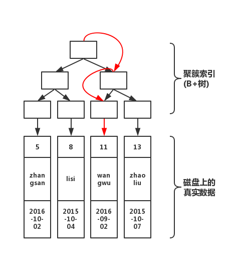
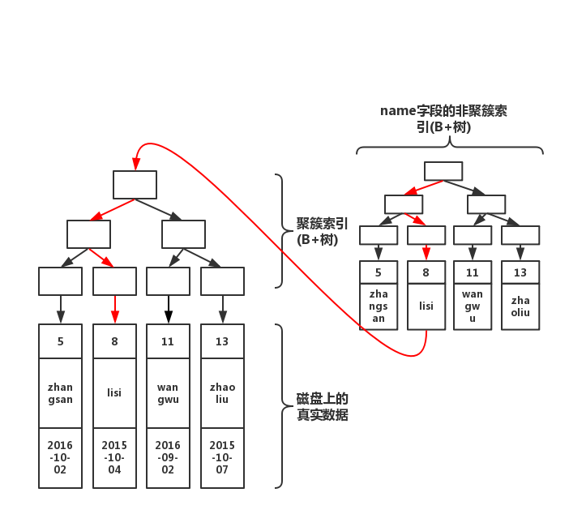

<!-- @import "[TOC]" {cmd="toc" depthFrom=1 depthTo=6 orderedList=false} -->

<!-- code_chunk_output -->

- [1. 基础模块](#1-基础模块)
  - [1.1. 数据类型](#11-数据类型)
  - [1.2. Float、Decimal 在存储金额时的区别？](#12-float-decimal-在存储金额时的区别)
  - [1.3. Datetime、Timestamp 存储时间的区别？](#13-datetime-timestamp-存储时间的区别)
  - [1.4. Char、Varchar、Binary,Varbinary 存储字符的区别？](#14-char-varchar-binaryvarbinary-存储字符的区别)
  - [1.5. MySQL 操作命令和内置函数](#15-mysql-操作命令和内置函数)
  - [1.6. mysql 执行流程](#16-mysql-执行流程)
- [2. 索引模块](#2-索引模块)
  - [2.1. hash 索引和 B+树索引的区别](#21-hash-索引和-b树索引的区别)
  - [2.2. 什么时候索引会失效？](#22-什么时候索引会失效)
  - [2.3. 什么情况下不推荐用索引？](#23-什么情况下不推荐用索引)
  - [2.4. 索引和锁的关系](#24-索引和锁的关系)
  - [2.5. 覆盖索引和回表？](#25-覆盖索引和回表)
  - [2.6. 查询时如何强制指定索引？](#26-查询时如何强制指定索引)
  - [2.7. 索引分类](#27-索引分类)
    - [2.7.1. 主键索引（聚簇索引）：一个表只有一个](#271-主键索引聚簇索引一个表只有一个)
    - [2.7.2. 非主键索引的 B+树叶子节点存储的什么？](#272-非主键索引的-b树叶子节点存储的什么)
    - [2.7.3. 唯一索引（unique）：允许有空，不能重复，一个表可以多个](#273-唯一索引unique允许有空不能重复一个表可以多个)
    - [2.7.4. 普通索引：](#274-普通索引)
    - [2.7.5. 全文索引](#275-全文索引)
    - [2.7.6. 组合索引：最左匹配原则](#276-组合索引最左匹配原则)
    - [2.7.7. MySQL 中 IS NULL、IS NOT NULL、!= 能用上索引吗？](#277-mysql-中-is-null-is-not-null-能用上索引吗)
- [3. 事务模块](#3-事务模块)
  - [3.1. ACID](#31-acid)
  - [3.2. 事务并发导致的问题](#32-事务并发导致的问题)
  - [3.3. 事务隔离级别](#33-事务隔离级别)
  - [3.4. mysql 默认事务隔离级别](#34-mysql-默认事务隔离级别)
  - [3.5. read view](#35-read-view)
  - [3.6. mysql MVCC（Multi-Version Concurrency Control：多版本并发控制）的实现原理](#36-mysql-mvccmulti-version-concurrency-control多版本并发控制的实现原理)
  - [3.7. MVCC 中的读分为哪两种？](#37-mvcc-中的读分为哪两种)
  - [3.8. @Transactional 失效的几种场景](#38-transactional-失效的几种场景)
  - [3.9. 什么是一致性非锁定读？](#39-什么是一致性非锁定读)
  - [3.10. 什么是一致性锁定读？](#310-什么是一致性锁定读)
  - [3.11. 事务的传播性](#311-事务的传播性)
  - [3.12. Innodb RR 级别是如何解决幻读的？（间隙锁）](#312-innodb-rr-级别是如何解决幻读的间隙锁)
  - [3.13. 为什么 在 RC 级别下，binlog 格式要设置成 row？](#313-为什么-在-rc-级别下binlog-格式要设置成-row)
- [4. 锁模块](#4-锁模块)
  - [4.1. 表锁](#41-表锁)
  - [4.2. 行锁（锁存在的记录）](#42-行锁锁存在的记录)
  - [4.3. 间隙锁 GapLock（锁不存在的记录，阻塞 insert 操作）](#43-间隙锁-gaplock锁不存在的记录阻塞-insert-操作)
  - [4.4. nex-key lock（间隙锁和行锁的合集称）](#44-nex-key-lock间隙锁和行锁的合集称)
    - [4.4.1. next -key lock 影响并发怎么办？](#441-next-key-lock-影响并发怎么办)
  - [4.5. select for update 什么情况会使用间隙锁？](#45-select-for-update-什么情况会使用间隙锁)
  - [4.6. 共享锁、排他锁](#46-共享锁-排他锁)
  - [4.7. 锁优化](#47-锁优化)
  - [4.8. mysql 如何监控死锁？](#48-mysql-如何监控死锁)
  - [4.9. AUTO-INC 锁（AUTO_INCREMENT 的原理）](#49-auto-inc-锁auto_increment-的原理)
- [5. 日志模块](#5-日志模块)
  - [5.1. binlog（归档日志）](#51-binlog归档日志)
    - [5.1.1. binlog 的三种模式的区别？](#511-binlog-的三种模式的区别)
  - [5.2. redo log（重做日志）：数据库崩溃后数据恢复](#52-redo-log重做日志数据库崩溃后数据恢复)
  - [5.3. undo log（回滚日志）：事务回滚](#53-undo-log回滚日志事务回滚)
  - [5.4. 慢查询日志](#54-慢查询日志)
- [6. 性能优化和分布式](#6-性能优化和分布式)
  - [6.1. 集群因子是什么？](#61-集群因子是什么)
  - [6.2. explain](#62-explain)
  - [6.3. mysql 读写分离](#63-mysql-读写分离)
  - [6.4. mysql 分库分表](#64-mysql-分库分表)
  - [6.5. mysql JOIN 的实现（Nested-Loop Join（嵌套循环连接））](#65-mysql-join-的实现nested-loop-join嵌套循环连接)
  - [6.6. 分区&分库&分表](#66-分区分库分表)
- [7. 参考](#7-参考)

<!-- /code_chunk_output -->

## 1. 基础模块

### 1.1. 数据类型

1. 数值类型
   整数类型包括 TINYINT、SMALLINT、MEDIUMINT、INT、BIGINT，浮点数类型包括 FLOAT 和 DOUBLE，定点数类型为 DECIMAL。
2. 日期/时间类型
   包括 YEAR、TIME、DATE、DATETIME 和 TIMESTAMP。
3. 字符串类型
   包括 CHAR、VARCHAR、BINARY、VARBINARY、BLOB、TEXT、ENUM 和 SET 等。
4. 二进制类型
   包括 BIT、BINARY、VARBINARY、TINYBLOB、BLOB、MEDIUMBLOB 和 LONGBLOB。

### 1.2. Float、Decimal 在存储金额时的区别？

- float，double 等非标准类型，在 DB 中保存的是近似值，而 Decimal 则以字符串的形式保存数值。
- float 和 double 是以二进制存储的，所以有一定的误差。

### 1.3. Datetime、Timestamp 存储时间的区别？

- 数据长度：timestamp 是 4 字节，datetime 是 8 字节。
- 存储范围：timestamp 是 1970 到 2038，datetime 没有限制
- 时区：timestamp 存储时会转换为 utc 时间，datetime 不转换，存的是什么就是什么。

### 1.4. Char、Varchar、Binary,Varbinary 存储字符的区别？

- char ，binary 使用固定长度的空间进行存储，varchar 和 varbinary 是不固定长度的。
- char 和 varchar 后面如果有空格，char 会自动去掉空格后存储，varchar 虽然不会去掉空格，但在进行字符串比较时，会去掉空格进行比较。
- binary 保存二进制字符串，它保存的是字节而不是字符，没有字符集限制，varbinary 保存变长的字符串，后面不会补\0。

### 1.5. MySQL 操作命令和内置函数

### 1.6. mysql 执行流程

## 2. 索引模块

### 2.1. hash 索引和 B+树索引的区别

### 2.2. 什么时候索引会失效？

1. 有 or 必全有索引; 要想使用 or，又想让索引生效，只能将 or 条件中的每个列都加上索引。
2. like 以%开头; 以%结尾可以使用。
3. where 中索引列需要类型转换;
4. where 中索引列有运算;
5. where 中索引列使用了函数;
6. 如果 mysql 觉得全表扫描更快时（数据少）;
7. 复合索引未用左列字段; 最左匹配原则。

### 2.3. 什么情况下不推荐用索引？

1. 数据唯一性差（一个字段的取值只有几种时）的字段不要使用索引
2. 频繁更新的字段不要使用索引
3. 字段不在 where 语句出现时不要添加索引,如果 where 后含 IS NULL /IS NOT NULL/ like ‘%输入符%’等条件，不建议使用索引
4. where 子句里对索引列使用不等于（<>），使用索引效果一般。

### 2.4. 索引和锁的关系

- mysql InnoDB 的行锁是基于锁引实现的。

### 2.5. 覆盖索引和回表？

覆盖索引：只需要在一棵索引树上就能获取 SQL 所需的所有列数据，无需回表。

### 2.6. 查询时如何强制指定索引？

FORCE INDEX

### 2.7. 索引分类

#### 2.7.1. 主键索引（聚簇索引）：一个表只有一个

参考：https://www.cnblogs.com/rjzheng/p/9915754.html

#### 2.7.2. 非主键索引的 B+树叶子节点存储的什么？

- 索引值
- 主键

#### 2.7.3. 唯一索引（unique）：允许有空，不能重复，一个表可以多个

#### 2.7.4. 普通索引：

#### 2.7.5. 全文索引

#### 2.7.6. 组合索引：最左匹配原则

#### 2.7.7. MySQL 中 IS NULL、IS NOT NULL、!= 能用上索引吗？

MySQL 中决定使不使用某个索引执行查询的依据就是成本够不够小，如果 null 值很多，还是会用到索引的。

使用二级索引查询的成本主要有：

- 读取二级索引记录的成本
- 将二级索引记录执行回表操作，也就是到聚簇索引中找到完整的用户记录的操作所付出的成本。

很显然，要扫描的二级索引记录条数越多，那么需要执行的回表操作的次数也就越多，达到了某个比例时，使用二级索引执行查询的成本也就超过了全表扫描的成本。如果这个条数占整个记录条数的比例特别大，那么就趋向于使用全表扫描执行查询，否则趋向于使用这个索引执行查询。

## 3. 事务模块

### 3.1. ACID

- 原性性（Actomicity）：事务是一个原子操作单元，其对数据的修改，要么全都执行，要么全都不执行。
- 一致性（Consistent）：在事务开始和完成时，数据都必须保持一致状态。这意味着所有相关的数据规则都必须应用于事务的修改，以操持完整性；事务结束时，所有的内部数据结构（如 B 树索引或双向链表）也都必须是正确的。
- 隔离性（Isolation）：数据库系统提供一定的隔离机制，保证事务在不受外部并发操作影响的“独立”环境执行。这意味着事务处理过程中的中间状态对外部是不可见的，反之亦然。
- 持久性（Durable）：事务完成之后，它对于数据的修改是永久性的，即使出现系统故障也能够保持。

### 3.2. 事务并发导致的问题

1. 脏读（dirty read）：A 事务读取 B 事务尚未提交的更改数据，并在这个数据基础上操作。如果 B 事务回滚，那么 A 事务读到的数据根本不是合法的，称为脏读。
2. 不可重复读（unrepeatable read）：A 事务读取了 B 事务已经提交的更改（或删除）数据。比如 A 事务第一次读取数据，然后 B 事务更改该数据并提交，A 事务再次读取数据，两次读取的数据不一样。
3. 幻读（phantom read）：A 事务读取了 B 事务已经提交的新增数据。注意和不可重复读的区别，这里是新增，不可重复读是更改（或删除）。这两种情况对策是不一样的，对于不可重复读，只需要采取行级锁防止该记录数据被更改或删除，然而对于幻读必须加表级锁，防止在这个表中新增一条数据。

> 不可重复读和幻读的区别?
>
> - 不可重复读重点在于 update 和 delete
> - 幻读的重点在于 insert

### 3.3. 事务隔离级别

解决事务引起的几个问题，从解决 0-3 个，一共 4 个隔离级别。

| 事务隔离级别                 | 说明               | 脏读 | 不可重复读 | 幻读 |
| :--------------------------- | :----------------- | :--- | :--------- | :--- |
| 读未提交（read-uncommitted） | 能读到未 commit 的 | 是   | 是         | 是   |
| 读提交（read-committed）     | 能读到 commit 了的 | 否   | 是         | 是   |
| 可重复读（repeatable-read）  | 重复读取，结果一样 | 否   | 否         | 是   |
| 串行化（serializable）       | 串行化             | 否   | 否         | 否   |

### 3.4. mysql 默认事务隔离级别

可重复读，MySQL 的可重复读隔离级别解决了幻读问题。是通过行锁和间隙锁的组合 Next-Key 锁实现的。

### 3.5. read view

### 3.6. mysql MVCC（Multi-Version Concurrency Control：多版本并发控制）的实现原理

1. InnoDB 里面每个事务有一个唯一的事务 ID，叫作 transaction id。它是在事务开始的时候向 InnoDB 的事务系统申请的，是按申请顺序严格递增的。
2. 对于数据库的每行记录，都会有三个隐藏字段：db_trx_id (事务 id)、db_roll_pt (回滚指针)、delete_flag(删除标记)。根据这几个字段，组成事务链。
3. INSERT：创建一条数据，db_trx_id 的值为当前事务 id, db_roll_pt 为 null 。
4. UPDATE：复制修改一行数据，将当前复制后这一行的 db_trx_id 置为当前事务的 id，db_roll_pt 是一个指针，指向复制前的那一条的，旧数据在 undo log 里面。
5. DELETE：复制一行数据，将当前复制后这一行的 db_trx_id 置为当前事务的 id，db_roll_pt 是一个指针，指向复制前的那一条的。并把 delete_flag 置为 true 。
6. SELECT：根据查询时的事务 id,作为版本号，与数据库中的版本比较。

### 3.7. MVCC 中的读分为哪两种？

- 快照读 (snapshot read)：读取的是记录的可见版本 (有可能是历史版本)，不用加锁（共享读锁 s 锁也不加，所以不会阻塞其他事务的写）
- 当前读 (current read)：读取的是记录的最新版本，并且，当前读返回的记录，都会加上锁，保证其他事务不会再并发修改这条记录

已提交读（Read commited）隔离级别下的事务在每次查询的开始都会生成一个独立的 ReadView。
可重复读（Read repeated）隔离级别则在第一次读的时候生成一个 ReadView，之后的读都复用之前的 ReadView。

### 3.8. @Transactional 失效的几种场景

- 底层数据库引擎不支持事务：如果数据库引擎不支持事务，则 Spring 自然无法支持事务。
- 在非 public 修饰的方法使用：@Transactional 注解使用的是 AOP，在使用动态代理的时候只能针对 public 方法进行代理。
- 方法中调用同类的方法：原因同上
- 异常被 catch 了，导致异常无法抛出，自然会导致事务失效。
- @Transactional 的参数设置错误，rollbackFor

### 3.9. 什么是一致性非锁定读？

一致性非锁定读讲的是一条记录被加了 X 锁其他事务仍然可以读而不被阻塞，是通过 innodb 的 MVCC 实现的。

### 3.10. 什么是一致性锁定读？

一致性锁定读讲的是我可以通过 SELECT 语句显式地给一条记录加 X 锁从而保证特定应用场景下的数据一致性。

- SELECT … FOR UPDATE
- SELECT … LOCK IN SHARE MODE

### 3.11. 事务的传播性

### 3.12. Innodb RR 级别是如何解决幻读的？（间隙锁）

### 3.13. 为什么 在 RC 级别下，binlog 格式要设置成 row？

mysql RC 模式下，没有解决幻读的问题，用 STATEMENT 方式可能会导致数据的不一致。

## 4. 锁模块

### 4.1. 表锁

每次操作锁住整张表。开销小，加锁快；不会出现死锁；锁定粒度大，发生锁冲突的概率最高，并发度最低；

### 4.2. 行锁（锁存在的记录）

- 每次操作锁住一行数据。开销大，加锁慢；会出现死锁；锁定粒度最小，发生锁冲突的概率最低，并发度也最高；
- 行锁锁住的是存在的记录行

### 4.3. 间隙锁 GapLock（锁不存在的记录，阻塞 insert 操作）

- 间隙锁锁住的是行之间的空隙

### 4.4. nex-key lock（间隙锁和行锁的合集称）

#### 4.4.1. next -key lock 影响并发怎么办？

间隙锁的引入，虽然解决了幻读的问题，但同时也降低了并发度。

假如业务需求并不需要间隙锁怎么办，这时可以将隔离级别 RC，在此级别下就不存在间隙锁了。

### 4.5. select for update 什么情况会使用间隙锁？

### 4.6. 共享锁、排他锁

### 4.7. 锁优化

### 4.8. mysql 如何监控死锁？

配置 mysql 参数 innodb_print_all_deadlocks，当死锁的时候会把死锁信息输出到日志中。

### 4.9. AUTO-INC 锁（AUTO_INCREMENT 的原理）

- AUTO-INC 锁是当向使用含有 AUTO_INCREMENT 列的表中插入数据时需要获取的一种特殊的表级锁。

## 5. 日志模块

### 5.1. binlog（归档日志）

#### 5.1.1. binlog 的三种模式的区别？

- STATEMENT：每一条会修改数据的 sql 语句会记录到 binlog 中。
- ROW：不记录 sql，仅需记录哪条数据被修改了，修改成了什么样子了。
- MIXED：混合型

### 5.2. redo log（重做日志）：数据库崩溃后数据恢复

### 5.3. undo log（回滚日志）：事务回滚

undo log 是 MVCC 实现的一个重要依赖，回滚的时候要用到 undo log

### 5.4. 慢查询日志

## 6. 性能优化和分布式

### 6.1. 集群因子是什么？

计算方法：

1. 扫描一个索引；
2. 比较某行的 ROWID 和前一行的 ROWID，如果这两个 ROWID 不属于同一个数据块，那么集群因子增加 1；
3. 整个索引扫描完毕后，就得到了该索引的集群因子。

集群因子反映了索引范围扫描可能带来的对整个表访问过程的 IO 开销情况，如果集群因子接近于表存储的块数，说明这张表是按照索引字段的顺序存储的。如果集群因子接近于行的数量，那说明这张表不是按索引字段顺序存储的。

### 6.2. explain

### 6.3. mysql 读写分离

### 6.4. mysql 分库分表

### 6.5. mysql JOIN 的实现（Nested-Loop Join（嵌套循环连接））

- Index Nested-Loop Join 索引嵌套循环连接：join 的列有 index,用索引优化
- Block Nested-Loop Join 块索引嵌套连接：join 的列没有 index,用 join buffer

### 6.6. 分区&分库&分表

## 7. 参考

[mysql 锁](https://www.cnblogs.com/deliver/p/5730616.html)
