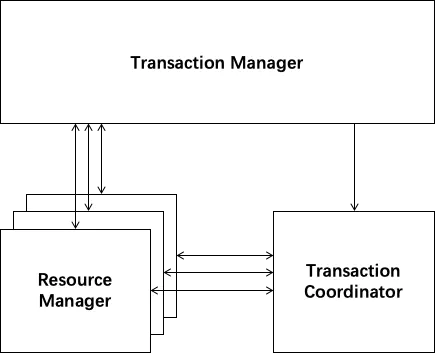

<!-- @import "[TOC]" {cmd="toc" depthFrom=1 depthTo=6 orderedList=false} -->

<!-- code_chunk_output -->

- [1. seata 介绍](#1-seata-介绍)
- [2. seata 整体划分](#2-seata-整体划分)
- [3. seata 工作流程](#3-seata-工作流程)
- [4. seata 的模式](#4-seata-的模式)

<!-- /code_chunk_output -->

## 1. seata 介绍

http://seata.io/zh-cn/docs/overview/what-is-seata.html

Seata 是一款开源的分布式事务解决方案，致力于提供高性能和简单易用的分布式事务服务。Seata 将为用户提供了 AT、TCC、SAGA 和 XA 事务模式，为用户打造一站式的分布式解决方案。

## 2. seata 整体划分

- TM(Transaction Manager)：全局事务管理器，控制全局事务边界，负责全局事务开启、全局提交、全局回滚。
- RM(Resource Manager)：资源管理器，控制分支事务，负责分支注册、状态汇报，并接收事务协调器的指令，驱动分支（本地）事务的提交和回滚。
- TC(Transaction Coordinator)：事务协调器，维护全局事务的运行状态，负责协调并驱动全局事务的提交或回滚。

## 3. seata 工作流程

AT 模式的工作流程分为两阶段。一阶段进行业务 SQL 执行，并通过 SQL 拦截、SQL 改写等过程生成修改数据前后的快照（Image），并作为 UndoLog 和业务修改在同一个本地事务中提交。

如果一阶段成功那么二阶段仅仅异步删除刚刚插入的 UndoLog；如果二阶段失败则通过 UndoLog 生成反向 SQL 语句回滚一阶段的数据修改。其中关键的 SQL 解析和拼接工作借助了 Druid Parser 中的代码

## 4. seata 的模式

AT： Auto Transaction ，基于支持本地 ACID 事务的关系型数据库，对业务无侵入；
MT： Manual Transaction ，不依赖于底层数据资源的事务支持，需自定义 prepare/commit/rollback 操作，对业务有侵入；
XA：基于数据库的 XA 实现。
TCC：TCC 模式，对业务有侵入。
